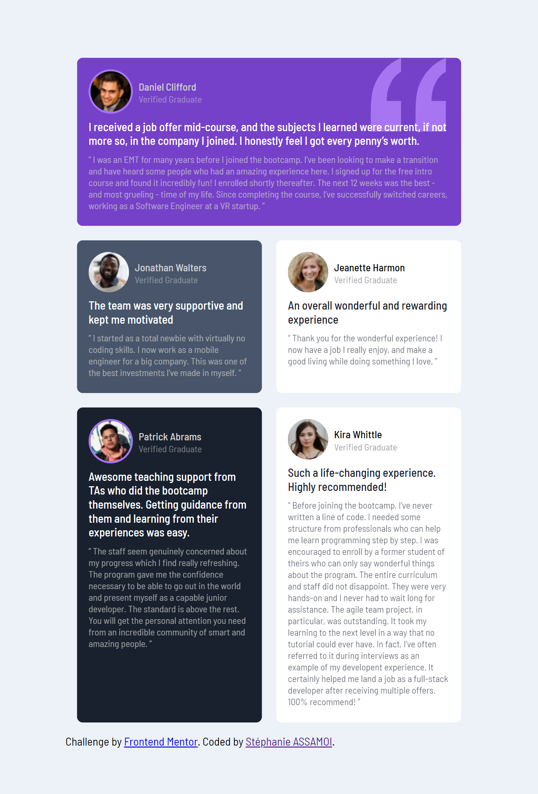

# Frontend Mentor - Testimonials grid section solution

This is a solution to the [Testimonials grid section challenge on Frontend Mentor](https://www.frontendmentor.io/challenges/testimonials-grid-section-Nnw6J7Un7). Frontend Mentor challenges help you improve your coding skills by building realistic projects. 

## Overview

### The challenge

Users should be able to:

- View the optimal layout for the site depending on their device's screen size

### Screenshot

### Links

- Solution URL: [Add solution URL here](https://github.com/Stephanie0905/Testimonial_grid)
- Live Site URL: [Add live site URL here](https://stephanie0905.github.io/Testimonial_grid/)

## My process

### Built with

- HTML5 
- CSS 
- Flexbox
- CSS Grid

